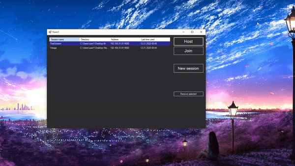

                            Explanation of this existing
========================
What's that?
-----------------------
That's just another way of syncronizing files but via TCP protocol.

What it could be needed for?
-----------------------
That's personal, but I do use this one myself for syncronizing files between different devices via the wifi.

I've made more than one syncronizer for some purposes, but this one is the one I wanted to be well done.

>Why don't use a ready from-the-box file share thing to keep files in cloud, so you could take these wherever and whenever you want?

That's a complicated question to answer, but I would like to wrap things up.
1. I love doing things my own. Especially if they require some knowledge oh how is this supposed to be done ~~, but that's not really the case~~.
1. That's a some kind of practise of doing application that might be really useful.
1. I dont trust all the clouds because the keep atleast log of action, which might be not really cool to think about sometimes.
1. I love do the things that way I want them to be working.
1. I need to take my freetime to make some stuff that I happy be dealing with.

Concept
----------------------
For now its just a pretty simple algorithm that resolves some file mismatches by asking user what is supposed to happen if they has different hashes and downloading/uploading files if they doesnt exist on another side. 
After resolving what is supposed to happen it actually goes for file tranfer based on TCP protocol.
Resolving goes with the commands that hidden inside Host, and the answers that goes to the Joined.

For now all the calculations are made on the Joined side ~~which is not quite right, but I had to mention that~~ and then Joined decides what to ask the server side about the file content.

It's all pretty raw and I guess it will comeout to something greater than that.

How to use it
========================

### Now it's only local network tested!

Since now, it's simplier than it was before. If you dont get something - write it in issues but first - check out the GIF instructions!

1. You have to make the session. It stores IP that it has to be connecting and port that will be used. Also dont forget about the directory that has to be syncronized!
To make that just start the program and press "New session" button. If you are hosting, local device IP will be used with the same port.

2. After you've made the session you have to host somewhere! Just because otherwise it's impossible to download from nowhere.

To make the host just select the row in the table of the session you want to be using and press Host.

3. After the Host is started (you may know by the message that came in the left down corner on Host window), it's time to start the Joined one!

To Join some Host you have to make the right session(see the 1st point), and press Join.

After the conflicts will be found you will see the Conflict Solver Form where you can decide what to do! When you are done with deciding press "Done" button.
After that all that you've made will be done by the program!

## !Important Hint!

Do not force close the window since it's done. It's making some hash storing job for you so you could use it fast! If you close it, it will have some issues that you have to solve. There's no guide yet, so write what you've got in issues.

Also bugs possible. Issues page is open - write that down and I will fix this most of them in the same day.

Contributing
========================
Making your own contribute
------------------------
~~The project could not be commented well but I will be working on it~~

If you would like to make some stuff along with this code - feel free to use it, and even if you want to help me developing it I would be even more feeling better about this working. 

The [contributing guide](https://github.com/Halozzee/TcpDirectorySyncronizer/blob/master/CONTRIBUTING.md) for this project.

I will be posting issues so, you could get one or several.

Having problems with understanding the code? You can ask me, I'm here daily.

Still dont what to do?
-----------------------

No worries, just come to [this](https://github.com/firstcontributions/first-contributions) repository and try it yourself!

Posting issues
-----------------------
If you want to be posting issues you have to see how are these issues has to look like.
For now there are templates for [Bug](https://github.com/Halozzee/TcpDirectorySyncronizer/blob/master/.github/ISSUE_TEMPLATE/bug_report.md) and [New feature](https://github.com/Halozzee/TcpDirectorySyncronizer/blob/master/.github/ISSUE_TEMPLATE/feature_request.md) issues.
